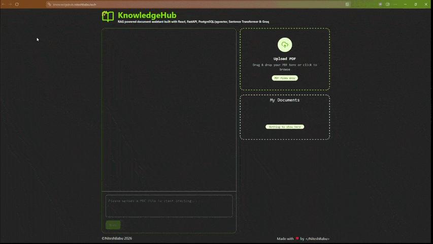

# Knowledge Hub

Knowledge Hub is an AI powered Retrieval-Augmented Generation (RAG) application that enables users to upload PDF documents and interact with them through natural language conversations. Knowledge Hub combines semantic search, vector embeddings, and Large Language Models to provide accurate, context-aware answers grounded in the uploaded documents.

## Features

* You can upload PDF documents
* You can chat with documents using natural language
* Semantic search powered by vector embeddings
* Retrieval-Augmented Generation (RAG) pipeline
* Background document processing
* Automatic document chunking and embedding generation
* Context-aware responses using Gemini and Groq LLMs
* Fast vector similarity search with PostgreSQL (pgvector)
* Session based user-specific document isolation

## Tech Stack

### Frontend

* React
* TypeScript
* Bun
* Tanstack Query, Axios
* Tailwind CSS

### Backend

* FastAPI
* PostgreSQL
* pgvector
* Redis
* Sentence Transformers
* Gemini API
* Groq API
* Session Based Rate Limiter 

## Architecture

1. User uploads a PDF document.
2. The document is processed asynchronously.
3. Text is extracted and divided into semantic chunks.
4. Embeddings are generated using Sentence Transformers.
5. Embeddings are stored in PostgreSQL using pgvector.
6. User submits a question.
7. Relevant document chunks are retrieved via vector similarity search.
8. Retrieved context is combined with the user's query.
9. Gemini or Groq generates a context-aware response.

## Project Highlights

* End-to-end RAG implementation
* Asynchronous document ingestion pipeline
* Semantic vector search using pgvector
* Background processing
* Multi-LLM support (Gemini & Groq)
* Modern React + TypeScript frontend
* FastAPI REST API architecture

